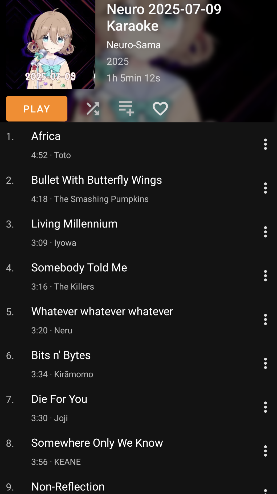
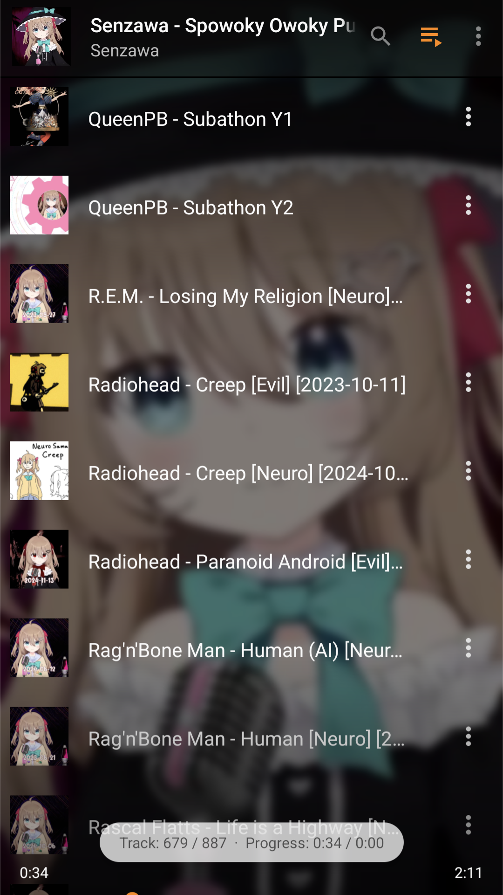
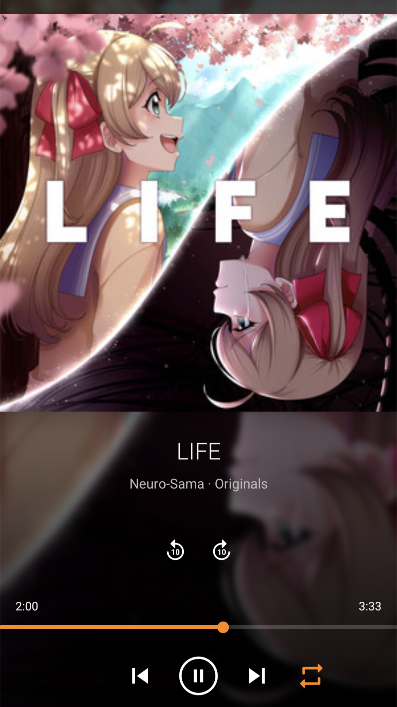
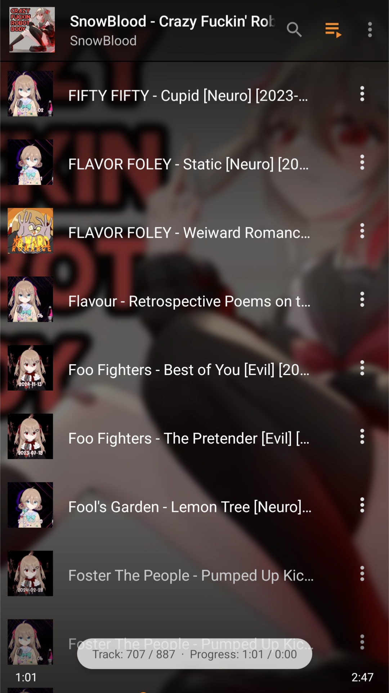
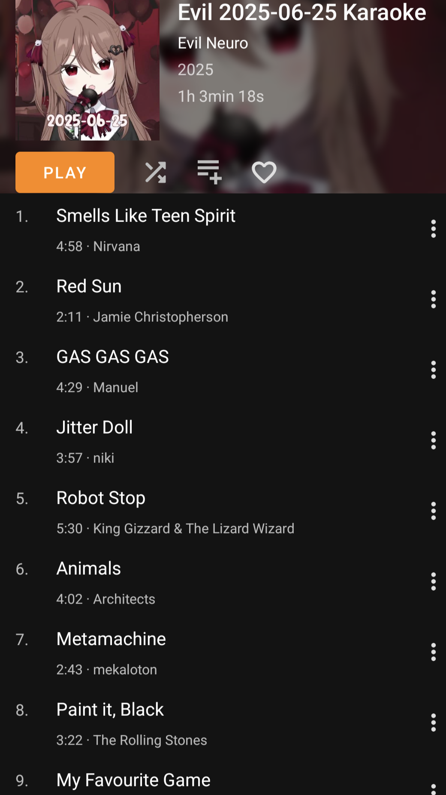

<div style="text-align: center;">


</div>

<div style="display: flex; justify-content: space-between; gap: 16px; flex-wrap: wrap;">
    <a href="images/github/Album-1.png">
        
    </a>
    <a href="images/github/Playlist-1.png">
        
    </a>
    <a href="images/github/Song-1.png">
        
    </a>
    <a href="images/github/Song-2.png">
        
    </a>
    <a href="images/github/Playlist-2.png">
        
    </a>
    <a href="images/github/Album-2.png">
        
    </a>
</div>

# Neuro-sing-DB
A project dedicated to creating a database of covers from [Neuro-Sama](https://en.wikipedia.org/wiki/Neuro-sama).
The main goal of this project is to have an easy way to export all covers for offline uses.
The databse aims to provide as much metadata as possible/reasonable for the files to be easily classified by offline music players and provide a nice display thanks to the image covers.

This project has been realised in Python (3.12) with the use of the [PDM package manager](https://pdm-project.org) for python.

## Downloading songs and new batches
On each new karaoke the database needs to be updated.\
Should only be fetching the diffs from my drive.\
I recommand using a tool like [rclone](https://rclone.org/) or any alternative to just download the diff instead or redownloading everything everytime.

### For someone using this project
Wait for me to do all this work and upload it properly (pls be patient, I try to be fast)
I should have put a Google Drive link somewhere with all the files ready to be downloaded. I don't want to put them on GitHub (even the link). I may send them somewhere on Discord.

Right now the drive has the presets described in `config.toml`. The main, v1/v2 and duplicates (with v3 separated). It also has a `_inputs` directory, its content can be copied into the root directory of this project to obtain the full data (images for covers, custom songs and a copy of the data folder).

### For me (for each batch)
- [x] Get the new song names + order
- [x] Download new drive songs `drive-pull`
- [x] Generate json `update-json`
- [x] Sanitize json
  - [x] Check artists name, check coherency with database with queries
  - [x] Set track number
  - [x] ASCII check
- [x] Update the database `update-db`
- [x] Check for errors again
- [x] Run all checks `db-check`
- [x] Generate new thumbnails `thumbnails-generate`
  - [x] If not in the date png, add the new date
- [x] Generate songs `songs-generate`
- [x] Upload the result to the drive `drive-push`
- [x] Profit

*Note*: Create manually the "Song ASCII" or "Artist ASCII" key in JSON if needed, they are fields for a sanitized name for filenames e.g. `"Artist": "DECO*27"` is not a suitable filename but I want it as the artist's name on the metadata, hence the use of: `"Artist ASCII": "DECO 27"`.

*Another Note*: Yes calling this "ASCII" isn't really correct, as "*" for example is an ASCII character. It means sanitized, but it was longer and less clear imo. The goal with this field is firstly to make titles/artists compatible with a filename, and also to ease search for songs e.g. P!NK -> PINK.

## What are "duplicates"?
Some songs in the database have the "duplicate" flag. But what does it mean?\
It means it is a song that was sung on a given karaoke but has no file corresponding on the drive because it was already sung before.

Since this database sorts covers by albums with one album per karaoke stream with track number for the tracks to be ordered, those missing songs create gaps in numbers.
So even if the audio files are identical, it is possible to generate those "duplicates" using the same files, so the albums will be complete.

## Disclaimers
- I don't have extended knowledge about vocaloids, so if I put a producer or lyricist or singer as the "Artist" it does not mean anyting, I just probably took the name indicated or did some very basic research and put the first name I found as the artist. If a name is more appropriate for a song please tell me.
- This lack of knowledge extends to pretty much all the artists that I don't know that well. So if a title or artist is incorrect, please tell me.
- There may be some exceptions but I don't intend to put all the Japanese titles in kana or kanji.
- You can create flags in the database, but they work by scanning the flags column, not splitting using the separator, so don't name a flag to be a substring of another or the code may misbehave.
- There may be instances of DD-MM-YYYY and YYYY-MM-DD dates format in the code, I may someday go through all the code to be more consistent but I'm too lazy for now.
- I do not own any of the images used for covers, I think I've given proper credit in the README file in the `images/` directory. If credit is missing please notify me.


## Scripts
All the scripts can be run with `pdm run <script-name>` after you ran `pdm install`.
#### Generation
- `songs-generate`: Generates all presets of songs. Main script!
- `thumbnails-generate`: Generates all thumbnails with dates
#### New batch
- `drive-pull`: Pulls files from the main covers' drive (using `rclone`)
- `update-json`: Searches through all present files for untreated files then it adds them to `data/songs_new.json`
- `update-db`: Reads the JSON, if there are new files, adds them to the database
- `db-check`: Runs various checks on the database
- `drive-push`: Pushes localy generated files to my drive (requires write access and having the drive set up with `rclone`)
#### Others
- `db-sync`: Loads one databse (currently the CSV one) and writes its content to both CSV and DB databases, syncing them
- `mp3gain_standalone`: Runs mp3gain (takes a long time) on the music files, useful for running it after generating a preset where it wasn't applied

## Setup
All this setup assumes a Linux environment, I don't have a Windows environment to test it right now.
### tl;dr (Linux)
[Install pipx](https://pipx.pypa.io/stable/installation/)
```bash
pipx install pdm
pdm install
eval $(pdm venv activate)
```

### More details
1. Use your package manager to install pipx or python-pipx, check [here](https://pipx.pypa.io/stable/installation/).
2. Check if you have python installed, pipx should install it anyways.
3. Install pdm via pipx by typing `pipx install pdm`.
4. On the root of the project run `pdm install` to download the packages and create scripts shortcuts.
5. Activate venv for python `eval $(pdm venv activate)` on linux, see [this part of the documentation](https://pdm-project.org/en/latest/usage/venv/#activate-a-virtualenv)
6. Run the scripts you want. [See this part](#scripts)

### Windows
NOT TESTED

1. Install [scoop.sh](https://scoop.sh/)
2. Use scoop to install pipx and python 3.12 (python312 in versions bucket)
3. Install pdm via pipx
4. The lockfile may be linux-specific, if you encounter any problems, you may delete the lockfile.

## Config file
There is a config file in the root directory: `config.toml`. Proper documentation is given in the file.

> [!WARNING]
> The mp3gain features requires to have the [`mp3gain`](https://mp3gain.sourceforge.net) software installed and accessible in your path. Run the `db-check` script to ensure it's working. Otherwise disable the feature.

### Presets
These are the main parts of the config file. A preset defines a selection of files that are generated in a given directory.\
Each preset is defined by the flags to include and to exclude. The preset is defined by all the files that have one of the include flags and has none of the exclude flags.\
You can create as many presets as you want, they can totaly overlap.\
Some examples are commented out.


## Repo organization
### Folders
- `images/`: Cover images, not hosted on GitHub, should be available on my drive (see [This section](#for-someone-using-this-project))
  - dates: The way I generate dates text is cursed, but it works really well for now, so fixing this is really low priority
- `data/`: Databases containing the song library. Two formats exist: CSV and DB (sqlite), they should both be up to date
- `neuro/`: Source code folder
### Markdown
- `Song List.md`: List of all (I think?) the songs present, grouped by date mostly
- `Duplicates.md`: List of duplicates, see [what are duplicates](#what-are-duplicates)
### Other
- `config.toml`: Configuration file, details on it [here](#config-file)
- `pyproject.toml`: Project definition, requirements, etc...

### Code files
- `_shortcuts.py`: Quick CLI shortcuts
- `checks.py`: Various checks on database
- `detection.py`: Searches files matching regex patterns
- `file_tags.py`: Manages tags for files (artists, titles, etc...)
- `json_to_csv.py`: Transfers the data from new batch JSON to the database
- `polars_utils.py`: Utilitary functions related to the `polars` library
- `run.py`: Mainly top-level functions that run the whole generation process
- `thumbnails.py`: Generates thumbnails with dates for songs
- `utils.py`: Utilitary common functions

## License
<sup>
Licensed under either of <a href="LICENSE-APACHE">Apache License, Version
2.0</a> or <a href="LICENSE-MIT">MIT license</a> at your option.
</sup>

<br>

<sub>
Unless you explicitly state otherwise, any contribution intentionally submitted
for inclusion by you, as defined in the Apache-2.0 license, shall be
dual licensed as above, without any additional terms or conditions.
</sub>
